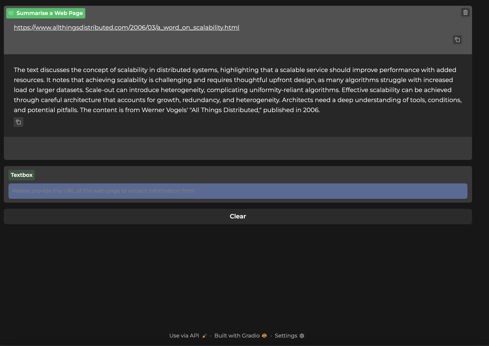

# AI Agent for Web Content Summarization

## Setup
### Set `.env` from `.env.example`:
```bash
MISTRAL_API_KEY=MistralAI API Key
MISTRAL_MODEL_NAME=MistralAI API Model Name
```

### Run Locally:
In a Python 3.12 environment shell of your choice, run the following command:

```bash
(venv) python -m pip install pre-commit pip-tools
(venv) pip-sync requirements/requirements.txt
```

### Run locally in dev mode:
```bash
(venv) pip-sync requirements/requirements.txt requirements/requirements-dev.txt
```

## Agent
### Dev:
1. In a Python 3.12 environment shell of your choice, run the following command:
```bash
(venv) fastapi dev src/app.py
```

2. In the address bar of your favourite browser, type in [http://127.0.0.1:8000](http://127.0.0.1:8000) to access the gradio UI, [http://127.0.0.1:8000/docs](http://127.0.0.1:8000/docs) to access API.


### Prod:
1. In a Python 3.12 environment shell of your choice, run the following command:
```bash
(venv) fastapi run src/app.py
```

2. In the address bar of your favourite browser, type in [http://0.0.0.0:8000](http://0.0.0.0:8000) to access the gradio UI, [http://0.0.0.0:8000/docs](http://0.0.0.0:8000/docs) to access API.

## Agent UI
1. Type in the URL you wish to extract summary of in the chat box and hit Enter.

